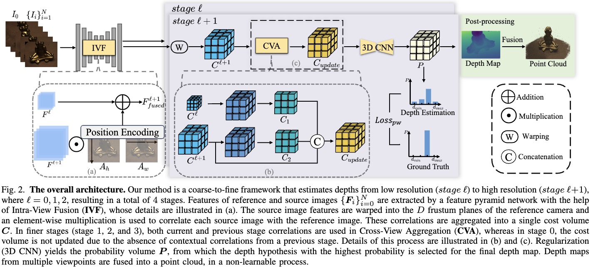
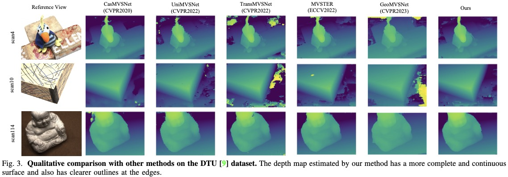

<h1 align="center">ICG-MVSNet: Learning Intra-view and Cross-view Relationships for Guidance in Multi-View Stereo (ICME 2025)</h1>

    <a href="https://yuhsihu.github.io" target='_blank'>Yuxi Hu</a>, 
    <a href="https://halajun.github.io/" target='_blank'>Jun Zhang</a>,  
    <a href="https://www.doublez.site" target='_blank'>Zhe Zhang</a>, 
    <a href="https://www.tugraz.at/institute/icg/research/team-fraundorfer/people/rafael-weilharter" target='_blank'>Rafael Weilharter</a>, 
    <a href="https://yuchenrao.github.io/" target='_blank'>Yuchen Rao</a>, 
    <a href="https://easonchen99.github.io/Homepage/" target='_blank'>Kuangyi Chen</a>, 
    <a href="https://scholar.google.com/citations?user=Qf-_DhUAAAAJ&hl=en" target='_blank'>Runze Yuan</a>, 
    <a href="https://www.tugraz.at/institute/icg/research/team-fraundorfer/people/friedrich-fraundorfer/" target='_blank'>Friedrich Fraundorfer</a>*

##  📌 Introduction
This repository contains the official implementation of **ICG-MVSNet: Learning Intra-view and Cross-view Relationships for Guidance in Multi-View Stereo**. 

🔧 Code is currently being cleaned and will be released soon!

## 🚀 Pipeline

## 🎯 Results  
### Qualitative Results  
  

### Quantitative Results  
Our results on DTU and Tanks and Temples (T&T) Dataset are listed in the tables.

| DTU | Acc. ↓ | Comp. ↓ | Overall ↓ |
| ----------- | ------ | ------- | --------- |
| Ours   | 0.327 | 0.251  | 0.289    |

| T&T (Intermediate) | Mean ↑ | Family | Francis | Horse | Lighthouse | M60   | Panther | Playground | Train |
| ------------------ | ------ | ------ | ------- | ----- | ---------- | ----- | ------- | ---------- | ----- |
| Ours          | 65.53  | 81.73  | 68.92   | 56.59 | 66.10      | 64.86 | 64.41   | 62.33      | 59.26 |